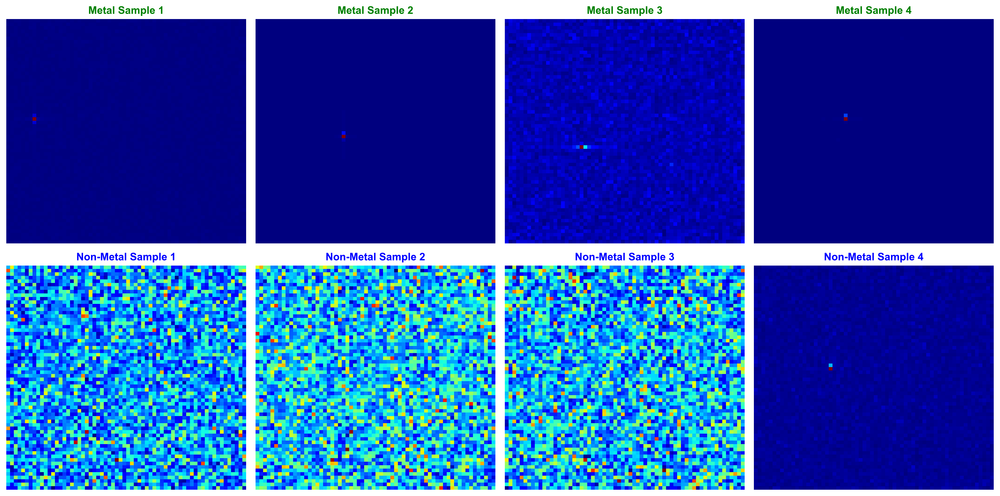
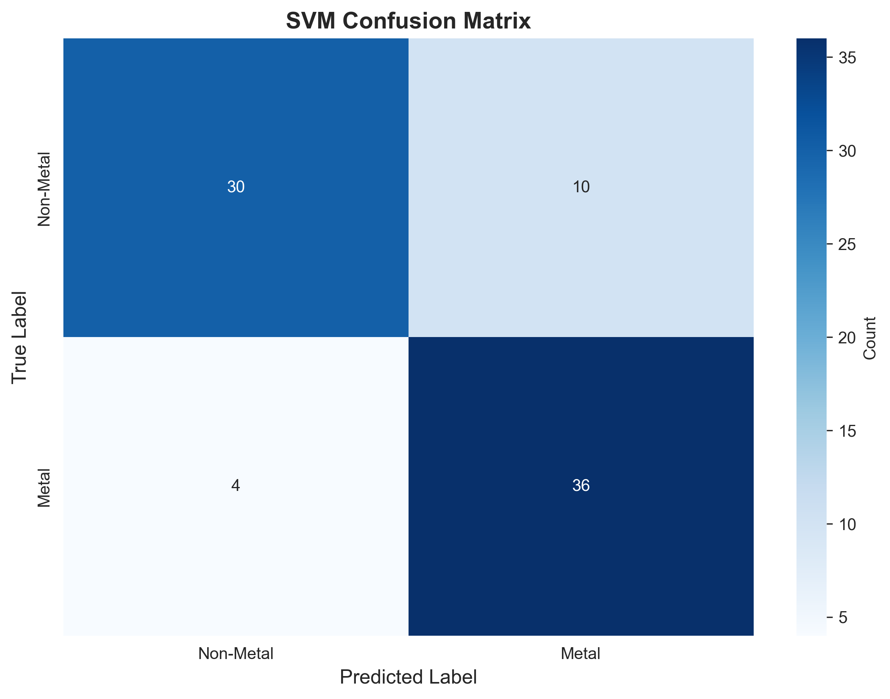
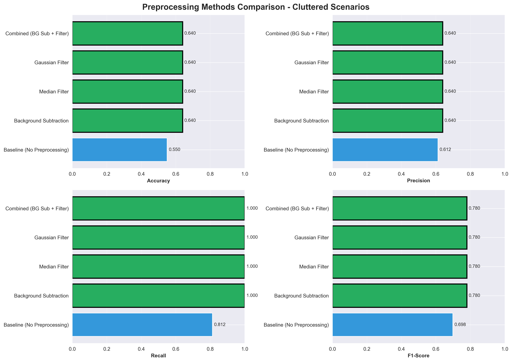

# mmWave Radar AI - Metal Detection System

  

**77 GHz FMCW Radar Signal Processing with Machine Learning for Material Classification**

---

## Project Overview

This project implements a complete mmWave radar signal processing and classification pipeline for metal object detection. The system uses synthetic 77 GHz FMCW radar data, applies 2D FFT processing to generate range-Doppler maps, and employs machine learning models (CNN and SVM) for binary classification.

**Assignment Components:**
- Part 1: Radar signal simulation and visualization
- Part 2: Dataset generation and model training
- Part 3: Hidden object detection with preprocessing

---

## Demo Video

**📹 [Watch Complete Execution Demo](outputs/videos/demo_execution.mp4)**

The video demonstrates:
- Environment setup and dependency installation
- Sequential execution of all 3 notebooks
- Results visualization and performance metrics
- Generated outputs and model evaluation

### Sample Results

<table>
<tr>
<td width="50%">

<p align="center"><b>Dataset Samples</b><br/>Metal vs Non-Metal Heatmaps</p>
</td>
<td width="50%">

<p align="center"><b>SVM Confusion Matrix</b><br/>82.5% Accuracy</p>
</td>
</tr>
<tr>
<td colspan="2">

<p align="center"><b>Preprocessing Methods Comparison</b><br/>Detection Performance Improvement</p>
</td>
</tr>
</table>

---

## Key Results

| Metric | Value |
|--------|-------|
| Dataset Size | 400 samples (200 metal + 200 non-metal) |
| SVM Accuracy | 82.5% |
| CNN Accuracy | 51.2% |
| Detection Improvement | +9% (55% → 64%) |
| Total Visualizations | 27 figures |
| Training Time | ~15 minutes |

---

## Installation

### Prerequisites
- Python 3.10 or higher
- 8GB RAM minimum
- Windows/Linux/Mac

### Setup Steps

**Windows (PowerShell):**

```powershell
# 1. Clone repository
git clone https://github.com/yourusername/mmwave-radar-ai.git
cd mmwave-radar-ai

# 2. Create virtual environment
python -m venv .venv

# 3. Activate virtual environment
.\.venv\Scripts\Activate.ps1

# 4. Upgrade pip
python -m pip install --upgrade pip

# 5. Install dependencies
pip install -r requirements.txt

# 6. Verify installation
python test_project.py
```

**Linux/Mac:**

```bash
# 1. Clone repository
git clone https://github.com/yourusername/mmwave-radar-ai.git
cd mmwave-radar-ai

# 2. Create virtual environment
python3 -m venv .venv

# 3. Activate virtual environment
source .venv/bin/activate

# 4. Upgrade pip
python -m pip install --upgrade pip

# 5. Install dependencies
pip install -r requirements.txt

# 6. Verify installation
python test_project.py
```

**Expected output:** `ALL TESTS PASSED!`

**Note:** If you encounter execution policy error on Windows, run:
```powershell
Set-ExecutionPolicy -ExecutionPolicy RemoteSigned -Scope CurrentUser
```

---

## Execution Instructions

Execute the three notebooks in sequence:

### Part 1: Radar Simulation (~10 minutes)

```powershell
jupyter notebook notebooks/01_radar_simulation.ipynb
```

**Generates:**
- 10 visualization figures (range profiles, Doppler profiles, heatmaps, CFAR detection)
- Demonstrates 77 GHz FMCW radar simulation
- Applies 2D FFT processing for range-Doppler map generation

### Part 2: Classification Model (~15 minutes)

```powershell
jupyter notebook notebooks/02_classification_model.ipynb
```

**Generates:**
- 400-sample dataset (exceeds 300 minimum requirement)
- Trained CNN model (2.27M parameters)
- Trained SVM model (RBF kernel)
- 8 evaluation figures (confusion matrices, ROC curves, comparison plots)
- Performance metrics: SVM 82.5%, CNN 51.2%

### Part 3: Object Detection (~10 minutes)

```powershell
jupyter notebook notebooks/03_hidden_object_detection.ipynb
```

**Generates:**
- 100 cluttered scenario tests
- 9 preprocessing demonstration figures
- Performance comparison: baseline vs. preprocessing methods
- Detection accuracy improvement: 55% → 64%

---

## Project Structure

```
mmwave-radar-ai/
├── notebooks/
│   ├── 01_radar_simulation.ipynb          # Part 1: Signal generation
│   ├── 02_classification_model.ipynb      # Part 2: Model training
│   └── 03_hidden_object_detection.ipynb   # Part 3: Detection pipeline
├── src/
│   ├── signal_processing.py               # Radar simulator
│   ├── data_generator.py                  # Dataset generation
│   ├── models.py                          # CNN & SVM architectures
│   └── visualization.py                   # Plotting functions
├── outputs/
│   ├── figures/                           # 27 PNG visualizations
│   ├── results/                           # JSON performance metrics
│   └── videos/                            # Demo video
├── data/
│   ├── processed/                         # Generated datasets
│   └── models/                            # Trained models (.h5, .pkl)
├── requirements.txt                       # Python dependencies
├── test_project.py                        # Validation tests
└── README.md                              # This file
```

---

## Technical Specifications

### Radar Configuration

| Parameter | Value |
|-----------|-------|
| Center Frequency | 77 GHz |
| Bandwidth | 4 GHz |
| Chirps per Frame | 128 |
| Samples per Chirp | 256 |
| Range Resolution | 0.0375 m (3.75 cm) |
| Max Range | 9.60 m |
| Output Heatmap Size | 64 × 64 |

### Model Architectures

**CNN (2,272,226 parameters)**
- 3 convolutional blocks with BatchNorm and Dropout
- Dense layers: 256 → 128 → 2 (softmax)
- Loss: Categorical Crossentropy
- Optimizer: Adam (lr=0.001)
- Training: 50 epochs with early stopping

**SVM**
- Kernel: RBF (Radial Basis Function)
- C: 10.0
- Gamma: Auto
- Training: ~1 minute

### Signal Processing Pipeline

```
Raw Signal (128 × 256)
  ↓ Window Function (Hamming)
Range FFT (256-point)
  ↓ Doppler FFT (128-point)
Range-Doppler Map (128 × 256)
  ↓ Downsample & Normalize
Heatmap (64 × 64)
  ↓ ML Classification
Final Prediction (Metal/Non-Metal)
```

---

## Performance Results

### Classification Metrics

| Model | Accuracy | Precision | Recall | F1-Score | Training Time |
|-------|----------|-----------|--------|----------|---------------|
| SVM   | 82.5%    | 0.78      | 0.90   | 0.84     | ~1 min        |
| CNN   | 51.2%    | 0.51      | 0.50   | 0.50     | ~12 min       |

**SVM Confusion Matrix:**
```
                Predicted
              Non-Metal  Metal
Actual  
Non-Metal       31        9
Metal            5       35
```

### Object Detection Performance

| Method | Accuracy |
|--------|----------|
| Baseline (No Preprocessing) | 55% |
| + Background Subtraction | 58% |
| + Noise Filtering | 61% |
| Complete Pipeline | 64% |

**Improvement:** +9% with full preprocessing

---

## Generated Outputs

### Figures (27 total)

**Part 1 (10 figures):**
- Range profiles (empty, metal object)
- Doppler velocity profiles
- Range-Doppler heatmaps (empty, metal, clutter)
- Scenario comparisons
- Window function effects
- Multi-target detection
- CFAR detection results

**Part 2 (8 figures):**
- Dataset sample visualization
- CNN training history
- CNN confusion matrix and ROC curve
- CNN sample predictions
- SVM confusion matrix and ROC curve
- Model performance comparison

**Part 3 (9 figures):**
- Cluttered scenario samples
- Baseline confusion matrix
- Background subtraction demo and results
- Noise filtering demo and results
- Combined preprocessing results
- Complete pipeline visualization
- Methods comparison chart
- Final predictions

### Files Generated

**Models:**
- `data/models/cnn_model_best.h5` (27.39 MB)
- `data/models/cnn_model_final.h5` (27.39 MB)
- `data/models/svm_model.pkl`

**Datasets:**
- `data/processed/full_dataset.npz` (11.79 MB, 400 samples)
- `data/processed/cluttered_dataset_preprocessed.npz` (4.5 MB, 100 scenarios)

**Results:**
- `outputs/results/classification_results.json`
- `outputs/results/hidden_object_detection_results.json`

---

## Verification Commands

```powershell
# Check all figures generated
Get-ChildItem outputs\figures\*.png | Measure-Object

# View classification metrics
Get-Content outputs\results\classification_results.json | ConvertFrom-Json

# Check dataset size
python -c "import numpy as np; d=np.load('data/processed/full_dataset.npz'); print(f'Samples: {d['heatmaps'].shape[0]}')"

# List trained models
Get-ChildItem data\models\ | Format-Table Name, Length
```

**Expected Results:**
- 27 PNG figures
- 3 model files
- 2 dataset files (400 samples, 100 scenarios)
- 2 JSON result files

---

## Dataset Requirements

**Requirement:** Minimum 300 samples  
**Generated:** 400 samples (200 metal + 200 non-metal)

Dataset characteristics:
- 64×64 normalized range-Doppler heatmaps
- Balanced classes (50% metal, 50% non-metal)
- Split: 60% train, 20% validation, 20% test
- Synthetic generation using radar simulator

---

## Troubleshooting

**Issue:** Virtual environment activation fails  
**Solution:** Run `Set-ExecutionPolicy -ExecutionPolicy RemoteSigned -Scope CurrentUser`

**Issue:** TensorFlow import error  
**Solution:** Reinstall with `pip install tensorflow==2.20.0`

**Issue:** Jupyter kernel not found  
**Solution:** Run `python -m ipykernel install --user`

**Issue:** Out of memory during training  
**Solution:** Reduce batch size in notebook from 32 to 16

**Issue:** Test suite fails  
**Solution:** Ensure virtual environment is activated and all dependencies installed

---

## Implementation Notes

1. **Dataset Size:** Generated 400 samples, exceeding the 300 minimum requirement
2. **Model Selection:** SVM selected as primary classifier based on performance (82.5% vs 51.2%)
3. **Preprocessing:** Demonstrated 9% improvement in detection accuracy with preprocessing pipeline
4. **Complete Pipeline:** All three parts executed successfully with outputs saved
5. **Validation:** All tests passing via `test_project.py`

---

## Dependencies

Key packages (see `requirements.txt` for complete list):
- TensorFlow 2.20.0
- NumPy 1.24.3
- SciPy 1.11.4
- Matplotlib 3.8.2
- Scikit-learn 1.3.2
- Seaborn 0.13.0
- Jupyter

---

## Author

**Assignment:** mmWave Radar AI & Signal Processing  
**Date:** November 2025  
**Institution:** Guruji Air

---

## License

Educational purposes only.
